最新消息，博主已开通B站账号：[Java刘哥](https://space.bilibili.com/160340478)

 

- 预览地址：[http://verio.liuyanzhao.com](http://verio.liuyanzhao.com)
- 详细介绍：[https://liuyanzhao.com/shop/verio.html](https://liuyanzhao.com/shop/verio.html)

## 博主开发的其他租房或房屋交易项目全部在这里  
[https://liuyanzhao.com/shop.html?k=房屋](https://liuyanzhao.com/shop.html?k=房屋)
- [基于SpringBoot+Vue房屋租赁系统 租房 Verio的Vue版本](https://liuyanzhao.com/shop/verio-vue.html)
- [基于SpringBoot的房屋租赁平台 房屋展示平台 留学生房屋租赁平台](https://liuyanzhao.com/shop/housekey.html)
- [基于SpringBoot/SSM的最新最轻量级最漂亮的的二手房屋交易系统RentUP](https://liuyanzhao.com/shop/rentup.html)
- [基于SpringBoot/SSM的房屋租赁系统租房系统Rello](https://liuyanzhao.com/shop/rello.html)
- [基于SpringBoot/SSM房屋租赁系统 verio3.0/协同过滤，房屋合租系统 租房系统](https://liuyanzhao.com/shop/verio.html)
- [基于SpringBoot房屋租赁系统manland4.0](https://liuyanzhao.com/shop/manland.html)

## 一、获取代码
- 需要完整代码联系博主，微信847064370

- 提供 
    - ① 完整源码 
    - ② 2小时项目讲解视频 
    - ③ ER图流程图等图 
    - ④ 远程部署 
    - ⑤ 问题解答，秒回

- 如果需要定制加功能，也可以联系博主。

- 最新消息，视频讲解已完成录制，并提交流程图、ER图，欢迎联系博主
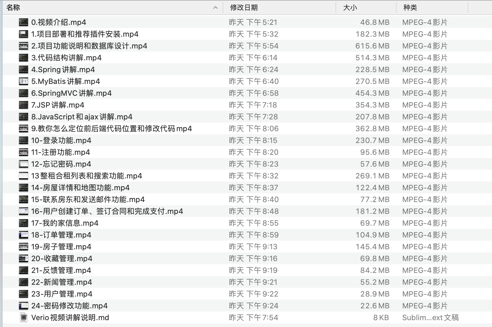

## 二、功能介绍
- 包括管理员、房东、租客三种角色，外加游客(未登录情况)
- 出租类型包含整租和合租
- 权限 游客 < 租客 < 房东 < 管理员

#### 1、游客功能

- 登录、注册(可以注册房东或租客)、搜索房子、查看箱子信息、新闻咨询查询
- 搜索功能，根据价格范围，面积范围，城市，小区，整租/合租搜索
- 房子信息，基本信息、轮播图、地图定位

#### 2、租客功能

- 预定房子(创建订单、签订合同、支付订单)
- 订单管理(取消订单、查看订单、查看合同、退租)
- 我的家(查看我的当前有效订单房子信息、查看合租情况)
- 反馈管理(提交反馈、反馈列表、删除反馈)
- 收藏管理(收藏房子、收藏列表、取消收藏)
- 个人信息修改、密码修改、联系房东(自动给房东发邮件)
- 发布求租信息，发布留言

#### 3、房东功能

- 房子管理(发布出租/编辑房子信息，发布后需要管理员审核；删除房子；下架房子)
- 订单管理(订单列表、退租、查看合同)
- 发布出租(包括标题、描述、价格、各种配套信息、地图位置、轮播图等20多个字段信息)
- 反馈管理(提交反馈、反馈列表、删除反馈)
- 个人信息、密码修改
- 发布求租信息，发布留言

#### 4、管理员功能
- 用户管理(禁用用户、启用用户)
- 房子管理(编辑房子、审核通过/驳回房子、下架房子)
- 订单管理(订单列表、退租、查看合同)
- 反馈管理(反馈列表、删除反馈、处理反馈)
- 新闻管理(新闻列表、发布新闻)

## 三、系统特色
- 1、前端界面简单大气、优雅
- 2、引用百度地图API，展示房子地图位置
- 3、房子图片轮播图展示美观
- 4、出租包含整租和合租
- 5、合租可以查看房子(同一个房产证且同一个房东)是否有室友，可以查看室友性别、职业、爱好，帮助租客选合适的室友
- 6、租客和房东都可以使用反馈功能，反馈网站问题或举报房东等
- 7、可以联系房东，直接给房东发送邮件通知
- 8、房子字段信息比较完整，满足大部分需求，可以在网站后台随意修改
- 9、房东发布房子默认状态为待审核，需要管理员审核通过才能展示和租赁
- 10、房子状态有多种：待审核、审核通过/可租赁、已租出、审核不通过
- 11、订单状态有多种：待签合同、待付款、合同已生效、已退租(合同失效)
- 12、包含新闻模块，管理员可以发布新闻咨询
- 13、租客可以收藏自己喜欢的房子
- 14、项目数据库表只有6张，很简单，不用怕复杂冗余的表
- 15、定时任务，定时查询合同到期的订单，更新订单状态为已退租，更新房屋状态为可租
- 16、报修、维修、账单、等等等...

## 四、技术组成
- SpringBoot版本（也有SSM版本）
- MyBatis
- 4JSP
- Bootstrap
- MySQL

## 五、项目结构
#### 1. 数据库设计
（图片可能未更新，以演示站最新为准）
- 良好的数据库设计规范，字段注释完整，有外键
- 用户表

- 订单表

- 房屋信息表

- 收藏表
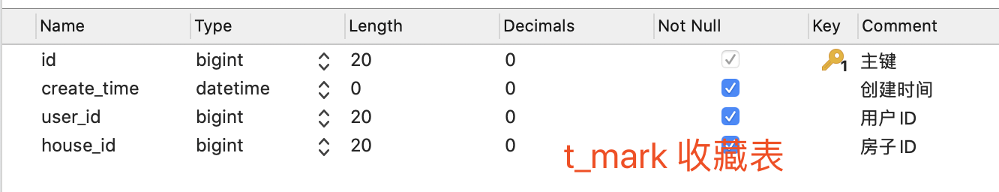
- 反馈表
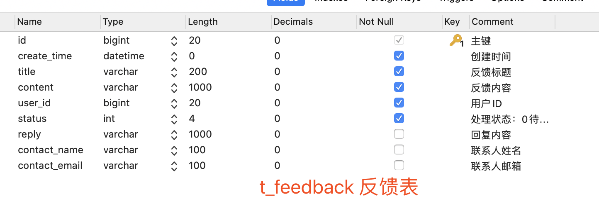
- 新闻表

- ER 图
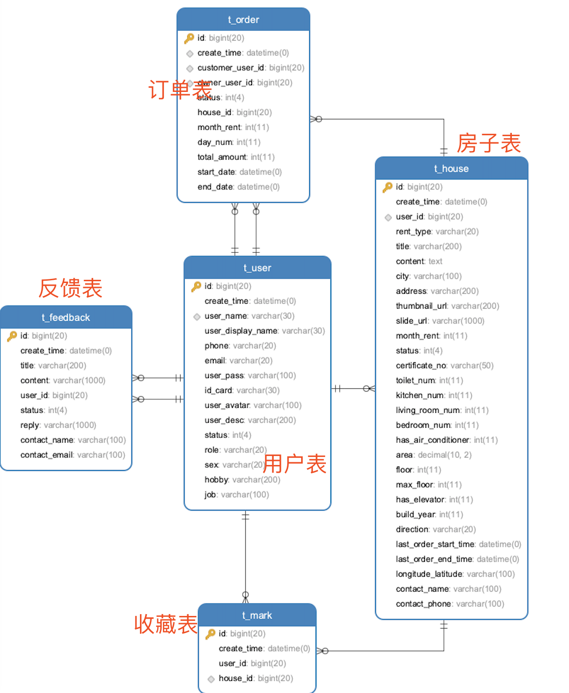
- 流程图
待补充, 包括ER图，手绘版本联系博主

#### 2、代码结构
项目结构是SpringBoot+JSP版本（也有SSM+JSP版本）
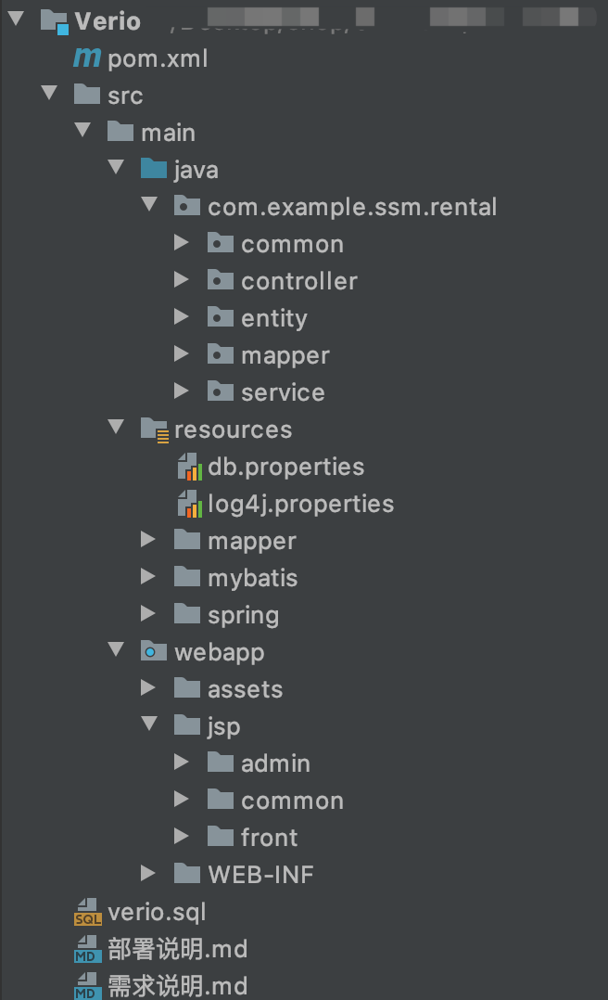

## 六、项目截图
（图片可能未更新，以演示站最新为准）

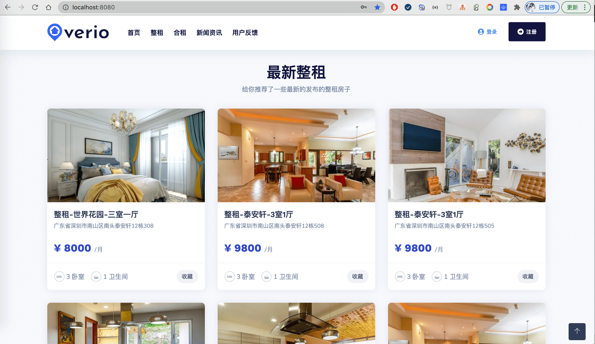
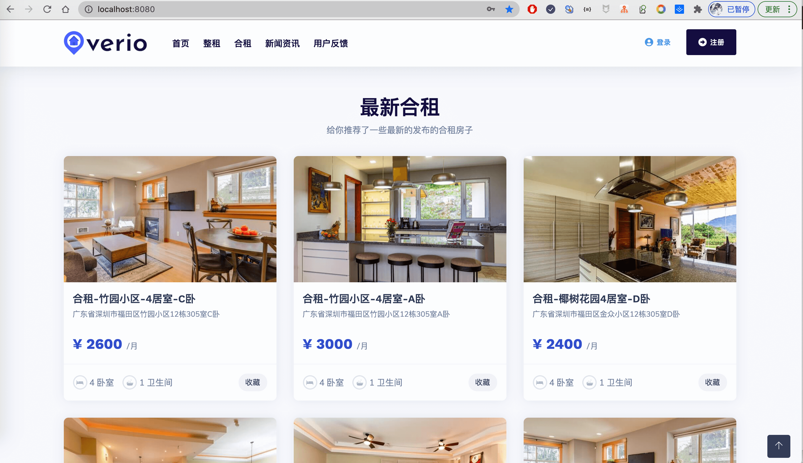
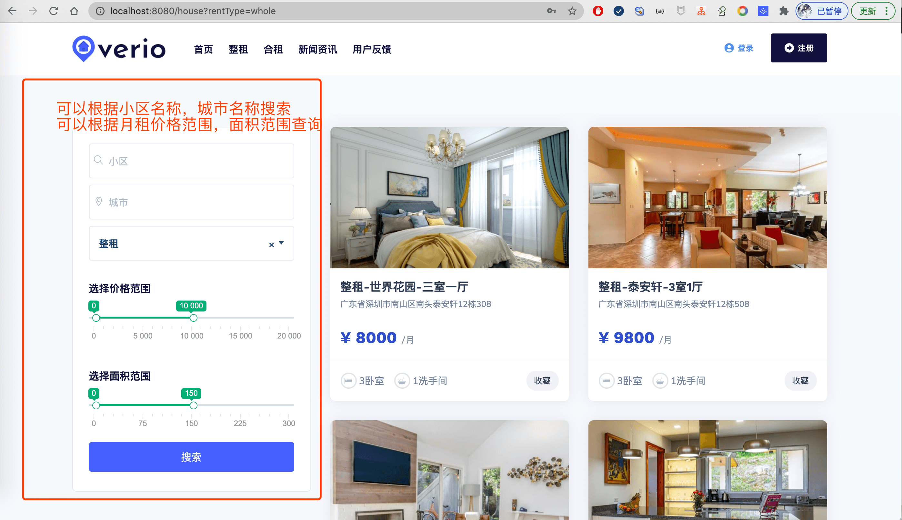

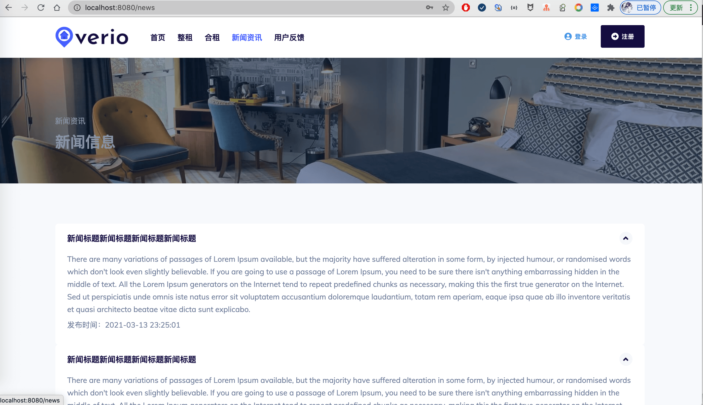

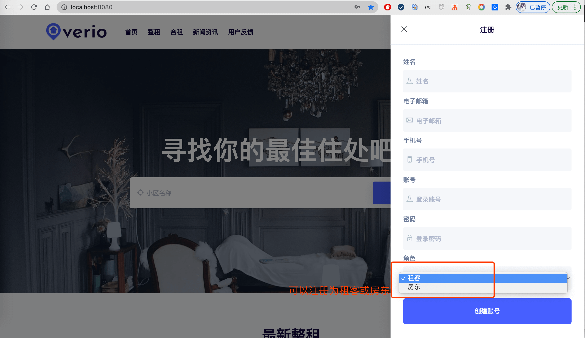

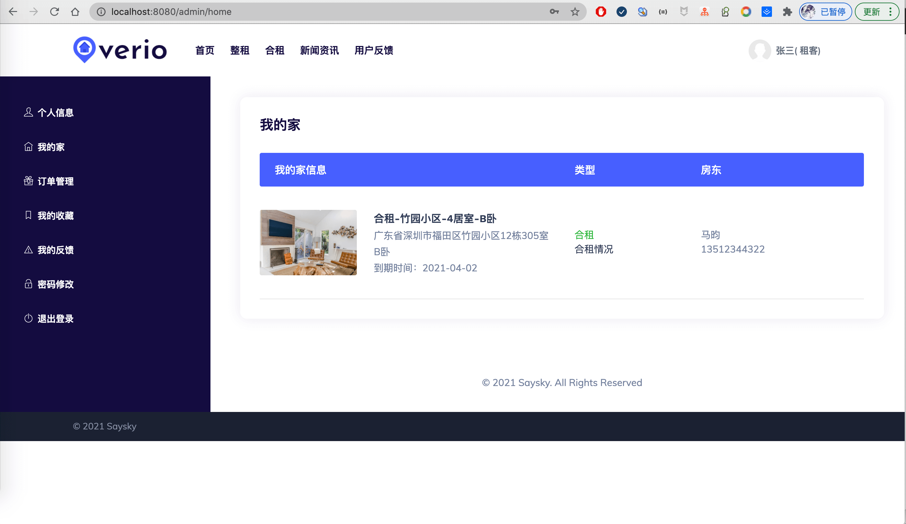

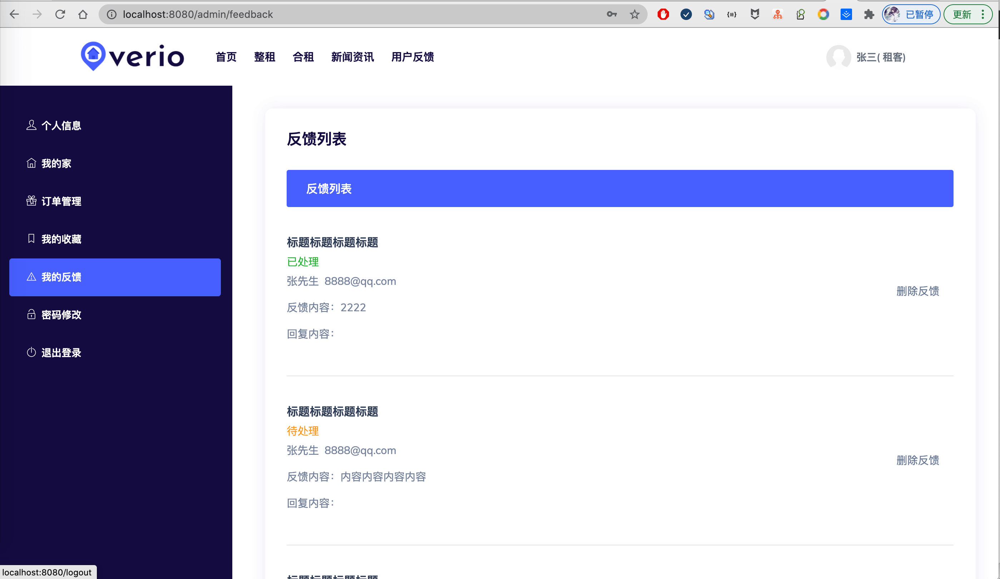

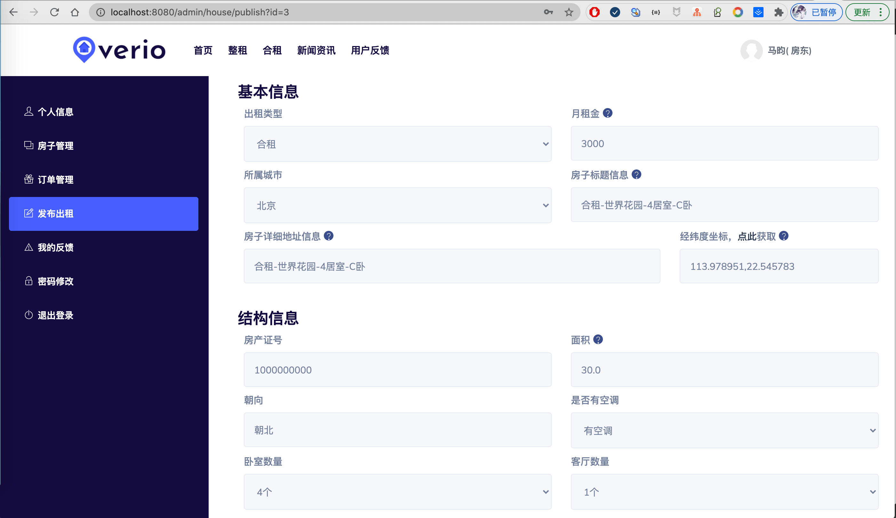

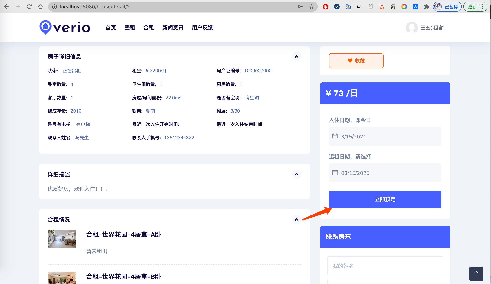
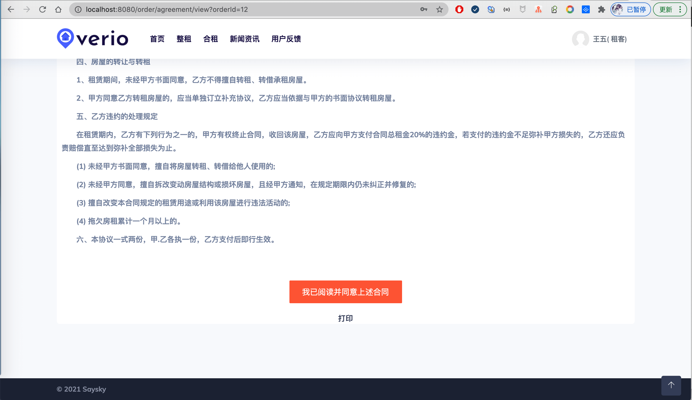

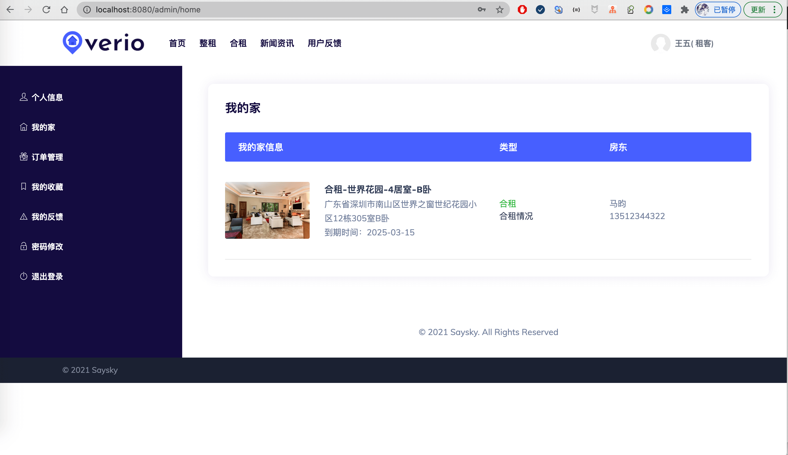

